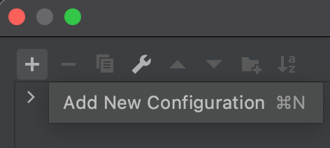
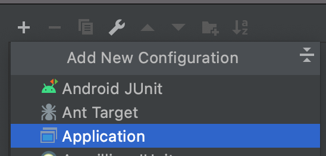
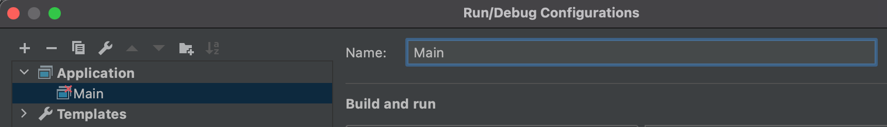
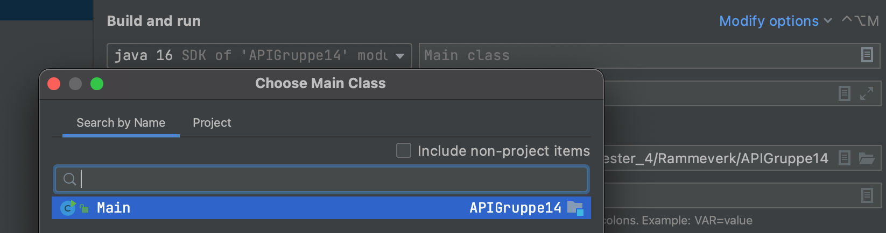
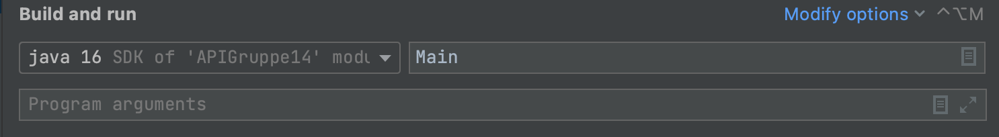

# Description:
## set up:

Open a new project in Intellij, or another perfered place to work with Java files. 
Extract the zip file, and open the foler as a new project. 

**This set up is for Intellij:**

option: You can do this beneath or just run the main java file, and then save the configuration in the top right corner

Choose the add configuration at the top right corner


Click on the pluss button to add a new configuration



Then click on the application button



Then rename the configuration to Main in the rename section



Then click on the button beneath modify options, and choose a new main class, choose the main class that is available.



Then enter ok.



The new configuration should look like this


## How to use the API:

You have to make an object from HTML class, and specify what kind of template you want to make. You can choose between
these templates, you choose them with an enum value:
STARTERPROJECT, HOME, ARTICLE, REGISTRATION, LOGIN

Example:

```java
HTML project=new HTML(websiteGenerator.Util.SiteType.<<insert chosenTemplate>>);

project.<<chosenTemplate>>; 
```

You can make more than one template, like this.

```java
HTML project=new HTML(websiteGenerator.Util.SiteType.HOME,Sitetype.ARTICLE,Sitetype.REGISTRATION,Sitetype.LOGIN,Sitetype.STARTERPROJECT);

```

To access the different templates you have made, you do it like this:

```java
project.home;
project.article;
project.registration;
project.login;
project.starterProject; 
```

You can use different methods for the templates. These methods are shared between all templates. header(), nav(), main()
, aside() footer(), completeTemplate().

```java
project.chosenTemplate.header();
project.chosenTemplate.header("(insert image-url)");
project.chosenTemplate.nav();
project.chosenTemplate.main();
project.chosenTemplate.aside();
project.chosenTemplate.footer();
project.chosenTemplate.header();
project.chosenTemplate.completeTemplate();
project.chosenTemplate.getTheme();
project.chosenTemplate.setTheme(Theme.(chosen theme));
```

You can choose between different design themes for you templates. DARK, LIGHT, FORREST, WATER, RETARDTHEME

```java
project.chosenTemplate.setTheme(Theme.DARK);
project.chosenTemplate.setTheme(Theme.LIGHT);
project.chosenTemplate.setTheme(Theme.FORREST);
project.chosenTemplate.setTheme(Theme.WATER);
project.chosenTemplate.setTheme(Theme.RETARDTHEME);
```

You can alswo view the current theme with getTheme() method.

```java
project.chosenTemplate.getTheme();
```

For the home template, there are some unique methods like

```java
project.home.hero("(some text for the hero header)","(insert image-url)");
```

For article template, you can chose the edit title, the bold parameter is optional.

```java
project.article.title("insert title text"," (choose header type between h1-h6)","Text size in integer");
project.article.title("insert title text"," (choose header type between h1-h6)","Text size in integer","bold (b -bold, n - normal)"); 
```

For article template, you can chose the edit body, the bold parameter is optional.

```java
project.article.body("insert title text"," (choose header type between h1-h6)","Text size in integer");
project.article.body("insert title text"," (choose header type between h1-h6)","Text size in integer","bold (b -bold, n - normal)"); 
```

You can make robots file for your project like this.

```java
HTML project = new HTML();

project.robots();
```

You can parse text files with textFileParser() the file will we parsed as &lt;p&gt; elements for each line seperation in
the file.

```java
HTML project = new HTML();

project.textFileParser("texfile.txt");
```

Create a table and populate it with text from a csv file. Choose the file as first parameter, and what to parse on in
the second.

```java
HTML project = new HTML();

project.CSVcontentParser("csvfile.csv",",");
```

## Scenarioer: 

(Some of the functionality like grids, and flexbox and stuff like that, will happen in the background)

1. Generate a starter project folder for a website project including standard html structure, css and javascript files.

2. Create a hero-header on the homepage,  with the image “headerImage.png’’ and heading text ‘’heading text’’.

3. Create a navbar on the top of the page with a logo to the left of the bar. The navbar must adapt to the screen size, on smaller screens (under 768px wide) the navbar shall collapse to a hamburger menu on the right.

4. Create a main section with flexbox where the user can choose the number of boxes. There shall be three columns on screens wider than 1024px. On screens smaller, there shall only be two columns.

5. Create an article and populate it with text from a plain text file ‘’textFile.txt’’. Text in the file should be parsed as p (paragraphs) elements, lines separated in the file shall be parsed in as new p elements.

6. Create a table and populate it with text from a csv ‘’file.csv’’. Header text should be made in the elements(table headers), while the other content should be placed in td elements (table cells). There user should be allowed to choose what sign to parse on

7. Create a footer that includes contact information, links to social media (fb, insta, linkedin, twitter), company logo, inputfield for subscribing to a newsletter and copyright.

8. Create a HTML file using the homepage template that adapts to the screen size using grids. The template includes header, navbar, main, aside and footer modules. 

9. Create a main section with a signup user form. The form shall consist of input fields for user information (name, address, email), as well as text labels for the fields, and a button for submitting the user information.

10. Create a main section with a login user form. The form shall consist of input fields for username and password, as well as text labels for the fields, and a button for submitting the login information.

11. Add functionality for changing the title, specifying the text size, heading type (h1-h6), and optionally add bold text and the text type of the text. 

12. Add functionality for changing the body, specifying the text size, heading type (h1-h6), and optionally add bold text and the text type of the text. 

13. Create and add a robots.txt file for your project.
